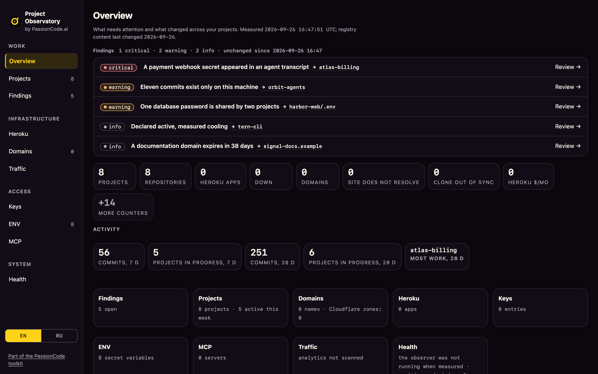

# Project Observatory

**See what changed across your projects, what needs attention, and where agent work left a trace.** Project Observatory is an open-source tool from [PassionCode.ai](https://passioncode.ai/), available today beside [Switchboard](https://passioncode.ai/switchboard/), and the local observation component of the [ssheleg harness](https://skills.sshlg.me/harness/). Skills guide the work; Observatory records and checks the state around it.



<sub>The real dashboard, rendered by `tools/demo_estate.py` over a fictional company's projects — no workspace, registry or key was read. Also in [Russian](docs/images/dashboard-overview-ru.png); the [projects page](docs/images/dashboard-projects-en.png).</sub>

Version 0.2 brings the original engine into the public distribution: project and repository inventory, findings, history, metrics, a local dashboard, MCP, credential tools and optional provider integrations. Every user supplies their own project paths, accounts and keys. Private operational data and Git history are excluded from the source distribution.

## Start with your own workspace

The complete engine supports macOS and Linux, Python 3.11+ and SQLite 3.37+ with loadable-extension support. Git and Node.js are needed for the complete local checks. On macOS, use an extension-enabled Python build such as Homebrew Python; some bundled builds cannot load sqlite-vec. The [onboarding guide](docs/ONBOARDING.md) checks this before setup.

```sh
git clone https://github.com/passioncode-ai/project-observatory-dashboard.git
cd project-observatory-dashboard
python3 -m venv .venv
. .venv/bin/activate
python -m pip install -c requirements-full.lock '.[full]'
export OBSERVATORY_HOME="$HOME/.local/share/project-observatory-full"
project-observatory full init
project-observatory full configure sources projects "$HOME/projects"
project-observatory full local
project-observatory full doctor
```

Use an existing directory you own in place of `$HOME/projects`. The first run needs no provider credentials. An agent can guide the setup: give it the [onboarding prompt](docs/AGENT-ONBOARDING.md), or run `project-observatory full onboard`.

### Open the dashboard

```sh
project-observatory full open            # builds the pages if needed, opens them as local files
project-observatory full open --serve    # serves them on 127.0.0.1:47311 (needed for the keys page's live actions)
```

### Choose the dashboard's language

The dashboard speaks English by default and Russian by choice. Set the language for your workspace, then rebuild the pages:

```sh
project-observatory full configure interface locale ru   # or: en
project-observatory full open --rebuild
```

Each reader can also switch with **EN / RU** in the navigation rail; that choice stays in the browser and works for pages opened as local files. Interface strings are translated; the texts the finding rules write stay in English. To add or change a string, see [Contributing](CONTRIBUTING.md#interface-strings).

`--no-browser` prints the address instead of opening it; `--rebuild` rebuilds the pages first; `--port` picks another loopback port. The pages live in `$OBSERVATORY_HOME/docs/dashboard/`, and `project-observatory full local` refreshes what they show. The server binds `127.0.0.1` only.

### Connect Claude Code (plugin updates automatically)

```sh
project-observatory full agent install   # marketplace + plugin, auto-update ON, hooks pointed at this workspace
project-observatory full agent status    # installed vs shipped version, auto-update, hook environment
project-observatory full agent uninstall # removes the plugin and only the settings install added
```

`install` adds the `passioncode-ai/project-observatory-dashboard` marketplace to Claude Code, installs `observatory-log@observatory-log`, turns plugin auto-update on and sets `OBSERVATORY_ROOT`/`OBSERVATORY_HOME` in Claude Code's user settings so the hooks find your workspace. It backs up `~/.claude/settings.json` once and keeps every other setting. Pass `--no-auto-update` to keep updates manual (`claude plugin update observatory-log@observatory-log`). An earlier directory-sourced install is replaced by the GitHub one. Without the helper: `/plugin marketplace add passioncode-ai/project-observatory-dashboard`, then `/plugin install observatory-log@observatory-log`. Restart Claude Code sessions after any change; plugins load at session start.

## What the complete engine does

| Question | Capability | Implementation |
|---|---|---|
| What projects and repositories exist? | Filesystem discovery, explicit ownership rules, repository and provider inventory | [collectors](observatory/engine/collectors), [configuration](observatory/engine/configuration.py) |
| What changed? | Git events, project timelines, append-only reasoning and review proposals | [store](observatory/engine/store), [survey](observatory/engine/survey.py) |
| What needs attention? | Findings with evidence, acknowledgements and coverage/degradation signals | [finding rules](observatory/engine/tools/build_findings.py) |
| Is a project growing or costing more? | Versioned metric plugins for source/dependency size, branches, releases, hosting and traffic | [plugin contract](observatory/engine/plugins/README.md) |
| Where are credentials used or copied? | Named slots, environment metadata, known-value scans, rotation and movement records | [vault](observatory/engine/tools/vault.py), [scanner](observatory/engine/tools/scan_leaks.py) |
| Can another agent inspect the same facts? | MCP tools and resources, input/output schemas, proposal authority checks | [MCP server](observatory/engine/mcp/server.py), [wire contract](observatory/engine/fabric/FABRIC-CONFORMANCE.md) |
| Can it observe continuously? | Explicitly enabled workspace-specific scheduling and optional model interpretation | [scheduler](observatory/engine/tools/install_launchd.py), [agent](observatory/engine/agent/observe.py) |

Optional integrations include GitHub, Bitbucket, Cloudflare, Heroku, Google analytics/search, domain observations, agent sessions and a local knowledge base. Connecting one does not connect all of them. Model calls, remote environment reads, notifications and remediation are opt-in. See [onboarding](docs/ONBOARDING.md) for settings and credential entry.

The local dashboard is private. The public `site/` is a separate marketing artifact and cannot read your workspace. Deploying the website must never upload generated dashboard pages, registries, keys or transcripts.

## Code is shared. State is yours.

| Installed code | Private workspace | External sources |
|---|---|---|
| Engine, schemas, generic defaults, tests and companion skills | Configuration, registries, SQLite history, keys, journals and generated pages | Only paths and accounts explicitly configured by the user |

Values enter credential tools locally through stdin. Agents work with names, and the command runner filters exact known values from captured output. This is accidental-output protection, not a sandbox against a hostile child process. The authenticated local credential UI can reveal a selected value on request; that is an explicit operation, not part of ordinary reports.

Known-value scanning cannot find unknown or transformed values. A copied value in an agent transcript or local memory store does not prove a vendor breach. [Security boundaries](SECURITY.md) describe what is and is not protected.

## Updates preserve supported contracts

The Python package is updated by reinstalling it (`python -m pip install -U -c requirements-full.lock '.[full]'` from an updated checkout, or the release wheel), followed by `project-observatory full upgrade`. The Claude Code plugin updates itself when auto-update is on; see `full agent status`.

Application versions, workspace/config formats, database migrations, plugin API and tool schemas have separate compatibility rules. Newer unsupported state is refused. Updates preserve optional settings, back up SQLite including committed WAL data, and support restore into a separate home.

```sh
project-observatory full upgrade
# Stop all writers before either command below.
project-observatory full workspace-backup --writers-stopped
project-observatory full upgrade --apply --writers-stopped
```

Read [compatibility and recovery](docs/COMPATIBILITY.md) before upgrading. The original `full backup` retains its database-only meaning. `workspace-backup` covers the managed workspace; externally referenced stores require separate backups.

**Existing 0.1 commands remain available.** `project-observatory init`, `scan`, `serve`, `secret`, `leaks` and the other original commands keep their previous namespace and state format. They are documented in the [0.1 compatibility guide](docs/PORTABLE-0.1.md). The full engine has a separate default home; it never silently reinterprets the portable workspace. [CLI contract](observatory/engine/docs/CLI-COMPATIBILITY.md).

## Verify and contribute

```sh
python -m unittest discover -s tests -v
project-observatory full check
python tools/check_public_release.py --history
```

Checks use synthetic projects and credentials. Real provider acceptance, external host admission and real credential rotation are separate checks and are reported as untested by the offline suite. The [source inventory](observatory/engine/SOURCE-INVENTORY.json) records the reviewed export; it is not a guarantee that a pattern scanner can recognize every private fact.

[Contributing](CONTRIBUTING.md) · [Security](SECURITY.md) · [Migration map](docs/MIGRATION.md) · [Release handoff](docs/HANDOFF.md)

MIT licensed. Part of [PassionCode.ai](https://passioncode.ai/) — the design system is [PassionCode 1.0.0](https://passioncode.ai/design-system/).


### Repository name and existing installations

The repository moved to the PassionCode.ai organization as `passioncode-ai/project-observatory-dashboard` in 0.4.0 (it was `ssheleg/project-observatory-dashboard`, and before that `ssheleg/project-observatory-open-source`).
The Python package and command remain `project-observatory`; no workspace migration
or key rotation is required just for the repository rename. Existing clones can
update their remote with `git remote set-url origin https://github.com/passioncode-ai/project-observatory-dashboard.git`,
and `project-observatory full agent install` moves the plugin marketplace to the new address.
Published v0.2.0 Fabric schema identifiers retain their original URLs and content
hashes. Do not rewrite them in an existing installation. GitHub redirects the old
repository path; verify pinned URL resolution before removing any compatibility URL.
